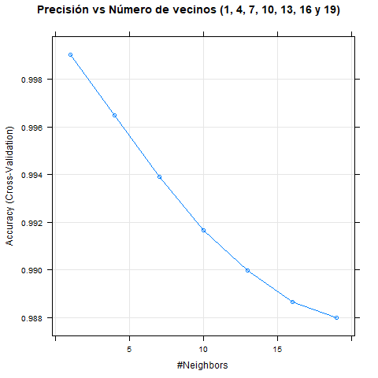

```{r, include=FALSE}
def.chunk.hook  <- knitr::knit_hooks$get("chunk")
knitr::knit_hooks$set(chunk = function(x, options) {
  x <- def.chunk.hook(x, options)
  ifelse(options$size != "normalsize", paste0("\n \\", options$size,"\n\n", x, "\n\n \\normalsize"), x)
})
```

```{r setup, include=FALSE}
knitr::opts_chunk$set(echo = TRUE, fig.align = 'center', size="footnotesize",
                      message = F, warning = F)
```


# Introducción

Durante el periodo entre 2014 y 2018 se logró tomar una cantidad significativa de datos sobre la accidentalidad en Medellín y algunas de sus zonas aledañas, para evidenciar así, el problema de movilidad que presenta el área. Estos datos se encuentran en el portal geomed, donde cada uno de estos incidentes se encuentra georreferenciado, dividido por barrio y comuna. Cuenta, además, con la información sobre la vía donde el accidente ocurrió y también sobre el tipo de accidente que se dio, la fecha de éste e incluso los daños perjudiciales causados a los ciudadanos -muertos, heridos o solo daños materiales-.

Ahora bien, al tener más de 200.000 datos durante este intervalo, el equipo se planteó el objetivo de darle un buen uso a estos, no sólo para analizar lo que sucedió en este lapso, sino también para ayudar a predecir accidentes a futuro y así poder esgrimir una función prevencionista. En ese orden de ideas, para acceder a la información recolectada y al presente análisis se habilitará el siguiente enlace XXXX. En donde la información a la que se accede estará presentada de una forma muy innovadora pues está desarrollada y pensada de forma interactiva e intuitiva, para obtener un mejor entendimiento del usuario.

# Objetivos

El análisis y los modelos que se pretenden construir sólo abarcan el área urbana de Medellín correspondiente a sus 16 comunas y sus respectivos barrios.

## General

Construir un sistema que le permita a la Secretaría de Movilidad de Medellín tomar decisiones en la creación de estrategias que ayuden a reducir la accidentalidad en zona específicas de Medellín, observando cuales son los tipos de accidentes más frecuentes en las diferentes comunas y sus barrios.

También se busca que el sistema les permita a todos los ciudadanos que se movilizan en un vehículo tomar precauciones respecto a los accidentes más frecuentes que suceden en lugares específicos.

Lo anterior creando una interfaz amigable para los usuarios y fácil de utilizar.

## Específicos

- Construir modelos que predigan el número de accidentes de cada tipo, tomando como entradas una ventana y una resolución temporal específicas, además de una zona espacial que puede ser un barrio o comuna de Medellín.

- Elaborar un sistema que agrupe barrios con características similares por los tipos de accidentes (clase) y que tienen lugar en estos.

- Crear una interfaz gráfica que le permita al usuario visualizar con mayor comodidad la accidentalidad que hay en Medellín y las predicciones de esta a futuro.


# Descripción y Limpieza de los datos

Los datos utilizados se encuentran en las bases de datos de Geomedellín (Portal Geográfico del Municipio de Medellín) y contienen información referente a múltiples accidentes de tránsito, en los que se detalla el tipo de accidente, dónde y cuándo ocurrió. La base de datos utilizada en este trabajo es una unión de las bases de incidentes en 2014, 2015, 2016, 2017 y 2018, se usará este último año para validar los modelos planteados.

La base de datos original cuenta con las siguientes variables:

- X: Componente de coordenada.
- Y: Componente de coordenada.
- OBJECTID: Id de cada incidente.
- RADICADO: Código emitido por la secretaría de movilidad de Medellín.
- FECHA: Fecha del incidente.
- HORA: Hora del incidente.
- DIA: Día del mes en el que ocurre el incidente
- PERIODO: Año del incidente.
- CLASE: Tipo de accidente
- DIRECCION.
- DIRECCION_ENC.
- CBML: Código de ubicación del predio en la ciudad.
- TIPO_GEOCOD: Tipo de 
- GRAVEDAD: repercusiones del accidente
- BARRIO.
- COMUNA.
- DISENO: clasificación del lugar del accidente.
- DIA_NOMBRE: Día de la semana en el que ocurre el incidente
- MES: Mes del incidente en número (del 1 al 12)
- MES_NOMBRE: Mes del incidente
- X_MAGNAMED: Componente de coordenada
- Y_MAGNAMED: Componente de coordenada
- LONGITUD: Componente de coordenada
- LATITUD: Componente de coordenada


Se deciden eliminar las variables "X", "Y", "X_MAGNAMED" y "Y_MAGNAMED" ya que cumplen la misma función que las variables "LONGITUD" y "LATITUD". También se elimina la variable "RADICADO" ya que sirve para identificar a un respectivo incidente, al igual que la variable "OBJECTID". Se elimina la variable "MES_NOMBRE" ya que es redundante el la base de datos, debido a que se encuentra la misma información en la variable "MES". Además ponerle los nombres a partir de la variable "MES" traería un aumento al coste computacional innecesario. También se decide eliminar las variables "DIRECCION", "DIRECCION_ENC", "CBML", "TIPO_GEOCOD" y "HORA" ya no serán de utilidad en el modelo.

Además se crea otra variable llamada "DIA_FESTIVO". Para poder analizar el número de accidentes en los días festivos y demás fechas especiales. Por lo tanto, las variables de interés que se usan en este proyecto son las siguientes:

- OBJECTID: Id de cada incidente.
- CLASE: Tipo de accidente
- GRAVEDAD: repercusiones del accidente
- COMUNA.
- BARRIO.
- DISENO: clasificación del lugar del accidente.
- LATITUD: Componente de coordenada
- LONGITUD: Componente de coordenada
- FECHA: Fecha del incidente.
- DIA: Día del mes en el que ocurre el incidente
- MES: Mes del incidente en número (del 1 al 12)
- PERIODO: Año del incidente.
- DIA_NOMBRE: Día de la semana en el que ocurre el incidente
- DIA_FESTIVO.

Definido lo anterior, se realiza una limpieza en la base de datos, ya que hay registros u observaciones que están mal escritos o simplemente no deberían estar. A continuación se explican los cambios realizados.

## Depuración

Se decide quitar los acentos a cada una de las variables categóricas debido a que hay valores repetidos los cuales representan el mismo nivel o categoria, pero con acento y sin acento. Un ejemplo de esto es el barrio Berlin de la comuna Aranjuez, el cual aparece 647 veces con el nombre de "Berlin" y 15 veces con el nombre de "Berlín". Por lo tanto se decide arreglar este problema.

### Para COMUNA

La variable COMUNA debe tener las comunas urbanas de Medellín y sus corregimientos.

Se sabe que en Medellín hay 16 comunas urbanas y 5 corregimientos, ambos están compuestos por barrios, por lo que la variable debería tener 16 + 5 = 21 niveles. Pero al observar los niveles de la variable "COMUNA" en el conjunto de entrenamiento, se evidencian 84 comunas, por lo cual se decide buscar las razones de esto y tratar de corregirlo.

**Comunas:** Popular, Santa Cruz, Manrique, Aranjuez, Castilla, Doce de Octubre, Robledo, Villa Hermosa, Buenos Aires, La Candelaria, Laureles-Estadio, La América, San Javier, El Poblado, Guayabal, Belén.

**Corregimientos:** Corregimiento de San Cristóbal, Corregimiento de San Antonio de Prado, Corregimiento de Santa Elena, Corregimiento de Altavista, Corregimiento de San Sebastián de Palmitas.

Uno de los problemas que se encuentra es que la persona encargada de digitar los datos se confundió entre las variables "COMUNA" y "BARRIO". Un ejemplo de esto es el barrio Boston que aparece como comuna en 2 observaciones, con su respectiva comuna (La candelaria) en barrio. Así como el ejemplo anterior, hay varios casos. Por lo cual, estas comunas y barrios se ponen en su posición correcta.

Luego de resolver el problema anterior, se encuentra que aún hay comuna que no pertenecen a las 21 mencionadas anteriormente, estas son: "In", "AU", "SN", "0". Al no encontrar información de estos valores en la página oficial o en internet, se decide reemplazar estos valores con sus respectivos barrios como datos faltantes o NA.

### Para BARRIO

Se detecta que los barrios contienen algunos problemas de espacios, algunos ejemplos son:

- "Asomadera No. 1" y "Asomadera No.1"
- "Aures No. 2" y "Aures No.2"
- "Bombona No. 1" y "Bombona No.1"
- "B. Cerro  El Volador" y "B. Cerro El Volador"

Por lo tanto se arregla este problema quitando el espacio que hay entre "No." y su número correspondiente en los barrios que tienen esta característica. También se eliminan los espacios que hay antes de la primera letra y después de la última letra.

También se reemplaza "Barrios de Jesús" por "Barrio de Jesús", "Nueva Villa de La Iguana" por "Nueva Villa de la Iguana",  "Santa María de Los Ángeles" por "Santa María de los Ángeles", "Villa Lilliam" por "Villa Liliam".

### Para CLASE

"Caida de Ocupante" se reemplaza por "Caida Ocupante" ya que se consideran equivalentes. También se elimina la observación con CLASE = "Choque y Atropello" ya que solo hay una.

### Para DIA_NOMBRE

Se eliminan los espacios que hay antes de la primera letra y después de la última letra en todas las observaciones.

## Imputación

En los datos faltantes de la variable DISENO, se decide usar el nombre de "No Registrado" para reemplazarlos.

En la base de datos se tiene la siguiente cantidad de datos faltantes por variable: la variable BARRIO tiene 19957 de datos faltantes, COMUNA tiene 19957 y CLASE tiene 7. Las demás variables no contienen datos faltantes.

Como la variable CLASE solo tiene 7 datos faltantes, se decide eliminar estas observaciones. Por el contrario, como BARRIO y COMUNA presentan una cantidad importante de los datos, se decide realizar una imputación de los mismos.

### Para COMUNA


Primero se decide realizar la imputación en la variable COMUNA, se utiliza un modelo knn (k-Nearest Neighbour) con variable respuesta COMUNA y como predictoras las variables LATITUD y LONGITUD escaladas. Dado que este es un modelo que usa la distancia euclidiana para clasificar observaciones, se piensa que funcionaría bien para clasificar a las comunas teniendo su ubicación en latitud y longitud.

Para ajustar el modelo se usó la función `train` del paquete `caret`, usando K-Fold CV con *K=10* y el número de vecinos igual a 1, 4, 7, 10, 13, 16 y 19. Se entrenó el modelo usando los años de 2014 a 2017 y se validó con el año 2018. Se usó la precisión de prueba del modelo como función de optimización. Los resultados obtenidos son los siguientes:

\begin{table}[h]
\begin{center}
\begin{tabular}{|c|c|c|c|c|c|}
\hline
Accuracy & Kappa  & AccuracyLower & AccuracyUpper & AccuracyNull & AccuracyPValue \\
\hline
0.9985 & 0.9984 & 0.9981 & 0.9989 & 0.2062 & 0 \\
\hline         
\end{tabular}
\end{center}
\end{table}


 **Accuracy** | **Kappa** | **AccuracyLower** | **AccuracyUpper** | **AccuracyNull** | **AccuracyPValue** |
-------------| -------------|-------------| -------------|-------------| -------------|
0.9985 | 0.9984 | 0.9981 | 0.9989 | 0.2062 | 0  

{#id .class width=50% height=50%}


Los resultados se consideran buenos y se decide realizar el reemplazo de los valores faltantes de COMUNA por medio de este modelo.

\newpage

### Para BARRIO

Se decide usar un modelo knn (k-Nearest Neighbour) con variable respuesta BARRIO y como predictoras las variables LATITUD y LONGITUD escaladas y COMUNA.

Dado que habían valores de barrios que están en el año 2018 pero no en los demás, no se pudo hacer uso del paquete `caret` ya que presentaba un error al entrenar el modelo, por lo que se decide usar  la función `knn.cv` del paquete `class`, para medir el comportamiento del modelo knn con k = 1 mediante LOOCV, entrenando el modelo con los años de 2014 hasta 2017 y validando el resultado con el año 2018. Se obtiene una precisión de prueba de 0.9975, por lo que se decide usar este modelo para imputar los datos faltantes en BARRIO.

## Base final

Finalmente se decide usar solo las comunas del área urbana de Medellín y dejar a un lado los corregimientos, es decir, solo se tendrán las 16 comunas mencionadas anteriormente en este reporte.

Tras las modificaciones mencionadas, de las 228693 observaciones originales entre las bases de datos del 2014 al 2018, se utilizarán 204002 observaciones en el análisis y construcción de los modelos. La base de datos luce de esta manera:

```{r, rows.print = 5}
df <- read.csv(file = "Base_definitiva.csv", header = T, nrows = 10000,
               stringsAsFactors = T)
df$FECHA <- as.Date(df$FECHA)
df
```

A continuación se encuentra el acceso al código utilizado en todo este proceso

Enlace: https://github.com/vagarciave/Project_x/blob/master/limpieza/Depuracion.Rmd

# Análisis descriptivo


# Modelos Predictivos

Se define la accidentalidad como el número de accidentes que hay a nivel diario, semanal y mensual, discriminando por tipo de accidente (CLASE) y barrio o comuna donde éste ocurre. Lo anterior debido a que existe una variabilidad notable a nivel de accidentalidad para cada columna y para cada barrio como se observó en el análisis descriptivo.

Dado que el objetivo es predecir la accidentalidad a nivel diario, mensual o semanal, se busca construir modelos que predigan el número de accidentes en cada uno de los rangos temporales es decir se crearán modelos específicos para cada comuna/barrio según la unidad temporal.

Se piensa que los modelos mixtos o modelos jerárquicos pueden representar bien esta definición de accidentalidad, debido a la agrupación que existe al momento de definir la accidentalidad, es decir, existe una agrupación entre comuna y clase; y otra agrupación entre barrio y clase. Por lo que se decide crear estos modelos con la ayuda del paquete `lme4` y medir su ajuste. En cada uno de estos casos se crea un modelo que prediga el número de accidentes, por lo que se considera que la accidentalidad puede seguir una distribución *Poisson*.

Para evaluar los modelos se crean conjuntos de entrenamiento y conjuntos de validación. Los conjuntos de entrenamiento constan de todas las combinaciones posibles de tipos de accidentes según si es comuna o barrio y su unidad de tiempo con los años (periodos) del 2014 al 2017, el conjunto de validación será con el año 2018.

La medida para evaluar el ajuste de los modelos será el error cuadrático medio en las predicciones tanto para los conjuntos de entrenamiento como para los de validación.

$$MSE = \frac{\sum_{i=1}^N (accidentalidad_i - \widehat{accidentalidad_i)^2}}{N}$$

Con la ayuda de R se crea la siguiente función para obtenerlo:

```{r}
MSE <- function(y, y_est) mean((y-y_est)**2)
```

Se usarán los siguientes paquetes para ajustar los modelos

```{r, message=F, warning=F}
library(lme4)      # Paquete para la creación de modelos mixtos poisson
library(tidyverse) # Paquete para la creación de los conjuntos de datos
```

## Ajuste de la base de datos

Se debe modificar la base de datos depurada para poder realizar los modelos. Se crean variables de tiempo a nivel diario, semanal y mensual, además de la variable accidentalidad y días festivos.

```{r, eval = F}
#  Vector con fechas de dias festivos
  # Definir dias festivos
  festivos <- ymd(c(
    #2014
    '2014-01-01','2014-01-06','2014-03-24','2014-04-17','2014-04-18', '2014-05-01',
    '2014-06-02','2014-06-23','2014-06-30','2014-07-20','2014-08-07', '2014-08-18',
    '2014-10-13','2014-11-03','2014-11-17','2014-12-08','2014-12-25',
    #2015
    '2015-01-01','2015-01-12','2015-03-23','2015-03-29','2015-04-02','2015-04-03',
    '2015-04-05','2015-05-01','2015-05-18','2015-06-08','2015-06-15','2015-06-29',
    '2015-07-20','2015-08-07', '2015-08-17','2015-10-12','2015-11-02','2015-11-16',
    '2015-12-08','2015-12-25',
    #2016
    '2016-01-01','2016-01-11','2016-03-20','2016-03-21','2016-03-24','2016-03-25',
    '2016-03-27','2016-05-01','2016-05-09','2016-05-30','2016-06-06','2016-07-04',
    '2016-07-20','2016-08-07', '2016-08-15','2016-10-17','2016-11-07','2016-11-14',
    '2016-12-08','2016-12-25',
    #2017
    '2017-01-01','2017-01-09','2017-03-20','2017-04-09','2017-04-13','2017-04-14',
    '2017-04-16','2017-05-01','2017-05-29','2017-06-19','2017-06-26','2017-07-03',
    '2017-07-20','2017-08-07', '2017-08-21','2017-10-16','2017-11-06','2017-11-13',
    '2017-12-08','2017-12-25',
    #2018
    '2018-01-01','2018-01-08','2018-03-19','2018-03-25','2018-03-29','2018-03-30',
    '2018-04-01','2018-05-01','2018-05-14','2018-06-04','2018-06-11','2018-07-02',
    '2018-07-20','2018-08-07', '2018-08-20','2018-10-15','2018-11-05','2018-11-11',
    '2018-12-08','2018-12-25',
    #2019
    '2019-01-01','2019-01-07','2019-03-25','2019-04-18','2019-04-19','2019-05-1',
    '2019-06-03','2019-06-24','2019-07-01','2019-07-20','2019-08-07','2019-08-19',
    '2019-10-14','2019-11-04','2019-11-11','2019-12-08','2019-12-25',
    #2020
    '2020-01-01','2020-01-06','2020-03-23','2020-04-9','2020-04-10','2020-05-01',
    '2020-05-25','2020-06-15','2020-06-22','2020-06-29','2020-07-20','2020-08-07',
    '2020-08-17','2020-10-12','2020-11-02','2020-11-16','2020-12-08','2020-12-25'
    ))

df <- df %>% select(COMUNA, CLASE, FECHA, PERIODO, MES, DIA_NOMBRE)

df$FECHA <- as.Date(df$FECHA)

# Se agrega la variable TIEMPO y MES_NOMBRE
df$MES_NOMBRE <- paste(df$PERIODO, df$MES, sep="-") %>% as.yearmon("%Y-%m")

# Para obtener la inversa se usaría: zoo::as.Date(df$FECHA, origin="2014-01-01")
df$TIEMPO_DIA <- as.numeric(as.Date(df$FECHA)) - as.numeric(as.Date("2014-01-01")) + 1

# Se crea la variable SEMANA
df <- df %>% mutate(SEMANA = strftime(FECHA, format = "%Y-%V"),
                          TIEMPO_SEMANA = match(SEMANA, sort(unique(SEMANA))))

# Se crea la variable MES
df <- df %>% mutate(MES = strftime(FECHA, format = "%Y-%m"),
                          TIEMPO_MES = match(MES, sort(unique(MES))))

# días festivos
df <- df %>% mutate(DIA_FESTIVO = ifelse(ymd(FECHA) %in% festivos,1,0))

# accidentalidad
df <- df %>% mutate(ACCIDENTALIDAD = 1)
```


## Modelos predictivos para las Comunas

Para obtener la base datos en la cual se encuentre el número de accidentes para cada evento considerado, se crea una base de datos con todos los eventos posibles con ayuda de la función `expand.grid`, en la cual se tiene en cuenta todas la combinaciones de comuna, clase (tipo de accidente) y fecha.

```{r, eval = F}
fecha_vector <- as.Date(as.Date("2014-01-01"):as.Date("2018-12-31"))
base <- expand.grid(COMUNA = levels(df$COMUNA), CLASE = levels(df$CLASE),
                             FECHA = fecha_vector)
base <- base %>% mutate(TIEMPO_DIA = as.numeric(FECHA) -
                                            as.numeric(as.Date("2014-01-01")) + 1)

# PERIODO
base <- base %>% mutate(PERIODO = as.numeric(format(FECHA,'%Y')))

# Se crea la variable SEMANA
base <- base %>% mutate(SEMANA = strftime(FECHA, format = "%Y-%V"),
                          TIEMPO_SEMANA = match(SEMANA, sort(unique(SEMANA))))

# Se crea la variable MES
base <- base %>% mutate(MES = strftime(FECHA, format = "%Y-%m"),
                          TIEMPO_MES = match(MES, sort(unique(MES))))

# días festivos
base <- base %>% mutate(DIA_FESTIVO = ifelse(ymd(FECHA) %in% festivos,1,0))
```

Luefo se realiza un *left join* con la base que contiene todos los posibles eventos y la base de datos que contiene la información de los accidentes (base depurada).

```{r, eval = F}
base <- left_join(base, subset(df, select = -DIA_NOMBRE),
                  by = c("COMUNA", "CLASE", "FECHA", "TIEMPO_DIA",
                                       "PERIODO", "SEMANA", "TIEMPO_SEMANA",
                                       "TIEMPO_MES", "DIA_FESTIVO"))
base[is.na(base)] <- 0

accidentes_dia_comuna <- left_join(base, distinct(df[, c("FECHA", "DIA_NOMBRE")]), by = "FECHA")
```

### Modelos - unidad de tiempo Día

La base de datos con el número de accidentes por comuna, clase y día se obtuvo anteriormente, ésta contiene 175296 observaciones.

```{r, include = F}
load(file = "accidentes_dia_comuna.RData") # base de datos
```

```{r}
dim(accidentes_dia_comuna)
```

La base luce de la siguiente manera:

```{r, echo=FALSE, rows.print = 5}
accidentes_dia_comuna <- subset(accidentes_dia_comuna, select=c(1,2,3,12,4,5,6,
                                                                7,8,9,10,11))
accidentes_dia_comuna
```

Se realiza la partición de los datos para seleccionar el conjunto de entrenamiento y el conjunto de prueba.

```{r}
test_dia_comuna <- accidentes_dia_comuna[accidentes_dia_comuna$PERIODO == 2018, ]
train_dia_comuna <- accidentes_dia_comuna[accidentes_dia_comuna$PERIODO %in%
                                            c(2014, 2015, 2016, 2017), ]
```

Se procede a la creación de modelos:

Se consideran distintos modelos partiendo de un modelo jerárquico con 2 niveles (CLASE y COMUNA) con solo un intercepto, ambos niveles o variables con efectos aleatorios se consideran correlacionados y se pondrá la variable CLASE (tipo de accidente) dentro de la variable comuna.

```{r, include=FALSE}
load(file = "mod_dia_comuna0.RData")
load(file = "mod_dia_comuna1.RData")
load(file = "mod_dia_comuna2.RData")
load(file = "mod_dia_comuna3.RData")
load(file = "mod_dia_comuna4.RData")
```

```{r, eval = FALSE}
mod_dia_comuna0 <- glmer(ACCIDENTALIDAD ~ 1 + (1 | COMUNA/CLASE),
                         data = train_dia_comuna, family= poisson())
mod_dia_comuna1 <- glmer(ACCIDENTALIDAD ~ DIA_FESTIVO + (1 | COMUNA/CLASE),
                         data = train_dia_comuna, family= poisson())
mod_dia_comuna2 <- glmer(ACCIDENTALIDAD ~ DIA_FESTIVO + TIEMPO_DIA + (1 | COMUNA/CLASE),
                         data = train_dia_comuna, family= poisson())
mod_dia_comuna3 <- glmer(ACCIDENTALIDAD ~ DIA_FESTIVO + DIA_NOMBRE + (1 | COMUNA/CLASE),
                         data = train_dia_comuna, family= poisson())
mod_dia_comuna4 <- glmer(ACCIDENTALIDAD ~ DIA_FESTIVO + DIA_NOMBRE +
                           (1 + DIA_FESTIVO| COMUNA/CLASE),
                         data = train_dia_comuna, family= poisson())
```

Se comparan los modelos por un analísis de varianza ANOVA:

```{r}
anova(mod_dia_comuna0, mod_dia_comuna1, mod_dia_comuna2, mod_dia_comuna3, mod_dia_comuna4)
```

Al parecer cada modelo explica mejor la accidentalidad que el anterior, pero se debe recordar que el *Valor-P* es sensible al número de datos. En la base de entrenamiento hay 140256 observaciones, esto se considera grande, por lo que no hay que fijarse mucho en el *Valor-P* dado que es más fácil que rechace las hipótesis nulas.

Se procede a calcular el MSE de entrenamiento y de prueba en cada uno de los modelos, cabe resaltar que los valores predichos se redondearán al entero más cercano debido a que son datos de conteo y la función `predict` devuelve valores en la escala original pero con décimales.

```{r}
# Modelo 0
y_est_train_dia_comuna0 <- round(predict(mod_dia_comuna0, newdata = train_dia_comuna,
                                         type = "response"),0)
y_est_test_dia_comuna0 <- round(predict(mod_dia_comuna0, newdata = test_dia_comuna,
                                        type = "response"),0)
mse_train_dia_comuna0 <- round(MSE(train_dia_comuna$ACCIDENTALIDAD,
                                   y_est_train_dia_comuna0),4)
mse_test_dia_comuna0 <- round(MSE(test_dia_comuna$ACCIDENTALIDAD,
                                 y_est_test_dia_comuna0),4)

# Modelo 1
y_est_train_dia_comuna1 <- round(predict(mod_dia_comuna1, newdata = train_dia_comuna,
                                         type = "response"),0)
y_est_test_dia_comuna1 <- round(predict(mod_dia_comuna1, newdata = test_dia_comuna,
                                        type = "response"),0)
mse_train_dia_comuna1 <- round(MSE(train_dia_comuna$ACCIDENTALIDAD,
                                   y_est_train_dia_comuna1),4)
mse_test_dia_comuna1 <- round(MSE(test_dia_comuna$ACCIDENTALIDAD,
                                  y_est_test_dia_comuna1),4)

# Modelo 2
y_est_train_dia_comuna2 <- round(predict(mod_dia_comuna2, newdata = train_dia_comuna,
                                         type = "response"),0)
y_est_test_dia_comuna2 <- round(predict(mod_dia_comuna2, newdata = test_dia_comuna,
                                        type = "response"),0)
mse_train_dia_comuna2 <- round(MSE(train_dia_comuna$ACCIDENTALIDAD,
                                   y_est_train_dia_comuna2),4)
mse_test_dia_comuna2 <- round(MSE(test_dia_comuna$ACCIDENTALIDAD,
                                  y_est_test_dia_comuna2),4)

# Modelo 3
y_est_train_dia_comuna3 <- round(predict(mod_dia_comuna3, newdata = train_dia_comuna,
                                         type = "response"),0)
y_est_test_dia_comuna3 <- round(predict(mod_dia_comuna3, newdata = test_dia_comuna,
                                        type = "response"),0)
mse_train_dia_comuna3 <- round(MSE(train_dia_comuna$ACCIDENTALIDAD,
                                   y_est_train_dia_comuna3),4)
mse_test_dia_comuna3 <- round(MSE(test_dia_comuna$ACCIDENTALIDAD,
                                  y_est_test_dia_comuna3),4)

# Modelo 4
y_est_train_dia_comuna4 <- round(predict(mod_dia_comuna4, newdata = train_dia_comuna,
                                         type = "response"),0)
y_est_test_dia_comuna4 <- round(predict(mod_dia_comuna4, newdata = test_dia_comuna,
                                        type = "response"),0)
mse_train_dia_comuna4 <- round(MSE(train_dia_comuna$ACCIDENTALIDAD,
                                   y_est_train_dia_comuna4),4)
mse_test_dia_comuna4 <- round(MSE(test_dia_comuna$ACCIDENTALIDAD,
                                  y_est_test_dia_comuna4),4)

```


```{r, include=F}
datos_mse <- data.frame(Modelo_Mixto_Poisson = c("ACCIDENTALIDAD ~ 1 + (1 | COMUNA/CLASE)",
                                          "ACCIDENTALIDAD ~ DIA_FESTIVO + (1 | COMUNA/CLASE)",
                                          "ACCIDENTALIDAD ~ DIA_FESTIVO + TIEMPO_DIA + (1 | COMUNA/CLASE)",
                                          "ACCIDENTALIDAD ~ DIA_FESTIVO + DIA_NOMBRE + (1 | COMUNA/CLASE)",
                                          "ACCIDENTALIDAD ~ DIA_FESTIVO + DIA_NOMBRE + (1 + DIA_FESTIVO | COMUNA/CLASE)"),
                        Train_MSE = c(mse_train_dia_comuna0, mse_train_dia_comuna1,
                                      mse_train_dia_comuna2, mse_train_dia_comuna3,
                                      mse_train_dia_comuna4),
                        Test_MSE = c(mse_test_dia_comuna0, mse_test_dia_comuna1,
                                     mse_test_dia_comuna2, mse_test_dia_comuna3,
                                     mse_test_dia_comuna4))
datos_mse <- datos_mse %>%
  mutate(Porcentaje_Variacion = round(100*abs(Train_MSE-Test_MSE)/(Train_MSE+Test_MSE), 2))
```

```{r, echo = FALSE}
knitr::kable(datos_mse)
```

En los modelos *mod_dia_comuna3* y *mod_dia_comuna4* se descarta usar la variable TIEMPO_DIA debido a que en lugar en disminuir el Test_MSE, lo aumentó, y tampoco mejoró el Train_MSE significativamente, por lo que se considera que no es significativa para explicar la accidentalidad en las comunas de Medellín por tipo de accidente.

Finalmente se observa que el modelo con intercepto y pendiente aleatoria **mod_dia_comuna4**:

$$\widehat{\text{ACCIDENTALIDAD}} = \text{DIA_FESTIVO} + \text{DIA_NOMBRE} + (1 + \text{DIA_FESTIVO} | \text{COMUNA/CLASE})$$

Es el que obtiene el menor *Train_MSE* y *Test_MSE*, por lo que se escoge este modelo para la explicación de la accidentalidad en comuna por día.

A continuación se muestran algunos de los valores observados de la accidentalidad diaria por clase y por comuna, con su respectivo valor predicho última columna) en el conjunto de prueba.

```{r, rows.print = 5, echo = F}
data.frame(test_dia_comuna, A.PREDICHA = y_est_test_dia_comuna4)
```

```{r, include=F}
remove(y_est_train_dia_comuna0, y_est_train_dia_comuna1, y_est_train_dia_comuna2, y_est_train_dia_comuna3, y_est_train_dia_comuna4, y_est_test_dia_comuna0, y_est_test_dia_comuna1, y_est_test_dia_comuna2, y_est_test_dia_comuna3, y_est_test_dia_comuna4,mse_train_dia_comuna0,mse_train_dia_comuna1,mse_train_dia_comuna2,mse_train_dia_comuna3,mse_train_dia_comuna4,mse_test_dia_comuna0,mse_test_dia_comuna1,mse_test_dia_comuna2,mse_test_dia_comuna3,mse_test_dia_comuna4)
```


### Modelos - unidad de tiempo Semana

Para este modelo se agrupa la unidad de tiempo por semanas, en las cuales se suma la cantidad de accidentes que suceden el la misma, también se suma el número de días festivos. La base luce como sigue:

```{r, rows.print = 5}
accidentes_semana_comuna <- accidentes_dia_comuna %>%
  group_by(COMUNA, CLASE, PERIODO, SEMANA, TIEMPO_SEMANA) %>%
  summarise(DIA_FESTIVO = sum(DIA_FESTIVO), ACCIDENTALIDAD = sum(ACCIDENTALIDAD))

accidentes_semana_comuna
```


Se procede a realizar la partición del conjunto de entrenamiento y el conjunto de prueba:

```{r}
test_semana_comuna <- accidentes_semana_comuna[accidentes_semana_comuna$PERIODO == 2018, ]
train_semana_comuna <- accidentes_semana_comuna[accidentes_semana_comuna$PERIODO %in%
                                                  c(2014, 2015, 2016, 2017), ]
```

Ahora se ajustan los modelos mixtos con efectos aleatorios en COMUNA y CLASE al igual que se hizo a nivel diario, es decir, CLASE dentro de COMUNA.

```{r, echo=F}
load(file = "mod_semana_comuna0.RData")
load(file = "mod_semana_comuna1.RData")
load(file = "mod_semana_comuna2.RData")
load(file = "mod_semana_comuna3.RData")
```

```{r, eval = F}
mod_semana_comuna0 <- glmer(ACCIDENTALIDAD ~  1 + (1 | COMUNA/CLASE),
               data = train_semana_comuna, family= poisson())
mod_semana_comuna1 <- glmer(ACCIDENTALIDAD ~  DIA_FESTIVO + (1 | COMUNA/CLASE),
               data = train_semana_comuna, family= poisson())
mod_semana_comuna2 <- glmer(ACCIDENTALIDAD ~  DIA_FESTIVO + TIEMPO_SEMANA +
                              (1 | COMUNA/CLASE),
               data = train_semana_comuna, family= poisson())
mod_semana_comuna3 <- glmer(ACCIDENTALIDAD ~  DIA_FESTIVO +
                              (1 + DIA_FESTIVO | COMUNA/CLASE),
               data = train_semana_comuna, family= poisson())
```

Se comparan los modelos por un analísis de varianza ANOVA:

```{r}
anova(mod_semana_comuna0, mod_semana_comuna1, mod_semana_comuna2, mod_semana_comuna3)
```

Se tiene el mismo problema del tamaño de muestra que en el modelo diario. Ahora, se procede a calcular el MSE de entrenamiento y de prueba en cada uno de los modelos, cabe resaltar que los valores predichos se redondearán al entero más cercano debido a que son datos de conteo y la función `predict` devuelve valores en la escala original pero con décimales.

```{r}
# Modelo 0
y_est_train_semana_comuna0 <- round(predict(mod_semana_comuna0, newdata = train_semana_comuna,
                                         type = "response"),0)
y_est_test_semana_comuna0 <- round(predict(mod_semana_comuna0, newdata = test_semana_comuna,
                                        type = "response"),0)
mse_train_semana_comuna0 <- round(MSE(train_semana_comuna$ACCIDENTALIDAD,
                                   y_est_train_semana_comuna0),4)
mse_test_semana_comuna0 <- round(MSE(test_semana_comuna$ACCIDENTALIDAD,
                                 y_est_test_semana_comuna0),4)

# Modelo 1
y_est_train_semana_comuna1 <- round(predict(mod_semana_comuna1, newdata = train_semana_comuna,
                                         type = "response"),0)
y_est_test_semana_comuna1 <- round(predict(mod_semana_comuna1, newdata = test_semana_comuna,
                                        type = "response"),0)
mse_train_semana_comuna1 <- round(MSE(train_semana_comuna$ACCIDENTALIDAD,
                                   y_est_train_semana_comuna1),4)
mse_test_semana_comuna1 <- round(MSE(test_semana_comuna$ACCIDENTALIDAD,
                                  y_est_test_semana_comuna1),4)

# Modelo 2
y_est_train_semana_comuna2 <- round(predict(mod_semana_comuna2, newdata = train_semana_comuna,
                                         type = "response"),0)
y_est_test_semana_comuna2 <- round(predict(mod_semana_comuna2, newdata = test_semana_comuna,
                                        type = "response"),0)
mse_train_semana_comuna2 <- round(MSE(train_semana_comuna$ACCIDENTALIDAD,
                                   y_est_train_semana_comuna2),4)
mse_test_semana_comuna2 <- round(MSE(test_semana_comuna$ACCIDENTALIDAD,
                                  y_est_test_semana_comuna2),4)

# Modelo 3
y_est_train_semana_comuna3 <- round(predict(mod_semana_comuna3, newdata = train_semana_comuna,
                                         type = "response"),0)
y_est_test_semana_comuna3 <- round(predict(mod_semana_comuna3, newdata = test_semana_comuna,
                                        type = "response"),0)
mse_train_semana_comuna3 <- round(MSE(train_semana_comuna$ACCIDENTALIDAD,
                                   y_est_train_semana_comuna3),4)
mse_test_semana_comuna3 <- round(MSE(test_semana_comuna$ACCIDENTALIDAD,
                                  y_est_test_semana_comuna3),4)
```


```{r, include=F}
datos_mse <- data.frame(Modelo_Mixto_Poisson = c("ACCIDENTALIDAD ~ 1 + (1 | COMUNA/CLASE)",
                                          "ACCIDENTALIDAD ~ DIA_FESTIVO + (1 | COMUNA/CLASE)",
                                          "ACCIDENTALIDAD ~ DIA_FESTIVO + TIEMPO_SEMANA + (1 | COMUNA/CLASE)",
                                          "ACCIDENTALIDAD ~ DIA_FESTIVO + (1 + DIA_FESTIVO | COMUNA/CLASE)"),
                        Train_MSE = c(mse_train_semana_comuna0, mse_train_semana_comuna1,
                                      mse_train_semana_comuna2, mse_train_semana_comuna3),
                        Test_MSE = c(mse_test_semana_comuna0, mse_test_semana_comuna1,
                                     mse_test_semana_comuna2, mse_test_semana_comuna3))
datos_mse <- datos_mse %>%
  mutate(Porcentaje_Variacion = round(100*abs(Train_MSE-Test_MSE)/(Train_MSE+Test_MSE), 2))
```

```{r, echo = FALSE}
knitr::kable(datos_mse)
```

En el modelo *mod_semana_comuna3* se descarta usar la variable TIEMPO_SEMANA debido a que en lugar en disminuir el Test_MSE, lo aumentó, y tampoco mejoró el Train_MSE significativamente, por lo que se considera que no es significativa para explicar la accidentalidad en las comunas de Medellín por tipo de accidente.

Finalmente se observa que el modelo con intercepto y pendiente aleatoria **mod_semana_comuna3**:

$$\widehat{\text{ACCIDENTALIDAD}} = \text{DIA_FESTIVO} + (1 + \text{DIA_FESTIVO} | \text{COMUNA/CLASE})$$

Es el que obtiene el menor *Train_MSE* y *Test_MSE*, por lo que se escoge este modelo para la explicación de la accidentalidad en comuna por semana.

A continuación se muestran algunos de los valores observados de la accidentalidad semanal por clase y por comuna, con su respectivo valor predicho (última columna) en el conjunto de prueba.

```{r, rows.print = 5, echo = F}
data.frame(test_semana_comuna, A.PREDICHA = y_est_test_semana_comuna3)
```

```{r, include=F}
remove(y_est_train_semana_comuna0, y_est_train_semana_comuna1, y_est_train_semana_comuna2, y_est_train_semana_comuna3, y_est_test_semana_comuna0, y_est_test_semana_comuna1, y_est_test_semana_comuna2, y_est_test_semana_comuna3,mse_train_semana_comuna0,mse_train_semana_comuna1,mse_train_semana_comuna2,mse_train_semana_comuna3,mse_test_semana_comuna0,mse_test_semana_comuna1,mse_test_semana_comuna2,mse_test_semana_comuna3)
```

### Modelos - unidad de tiempo Mes

Para este modelo se agrupa la unidad de tiempo por meses, en los cuales se suma la cantidad de accidentes que suceden el el mismo, también se suma el número de días festivos que hay en dicho mes. La base luce como sigue:

```{r}
accidentes_mes_comuna <- accidentes_dia_comuna %>% group_by(COMUNA, CLASE, PERIODO, MES, TIEMPO_MES) %>%
  summarise(DIA_FESTIVO = sum(DIA_FESTIVO), ACCIDENTALIDAD = sum(ACCIDENTALIDAD))

accidentes_mes_comuna
```

Se realiza la partición de la base de entrenamiento y de prueba

```{r}
test_mes_comuna <- accidentes_mes_comuna[accidentes_mes_comuna$PERIODO == 2018, ]
train_mes_comuna <- accidentes_mes_comuna[accidentes_mes_comuna$PERIODO %in%
                                            c(2014, 2015, 2016, 2017), ]
```

Ahora se ajustan los modelos mixtos con efectos aleatorios en COMUNA y CLASE al igual que se hizo a nivel diario y semanal, es decir, CLASE dentro de COMUNA.

```{r, include = F}
load(file = "mod_mes_comuna0.RData")
load(file = "mod_mes_comuna1.RData")
load(file = "mod_mes_comuna2.RData")
```

```{r, eval=FALSE}
mod_mes_comuna0 <- glmer(ACCIDENTALIDAD ~  1 + (1 | COMUNA/CLASE),
               data = train_mes_comuna, family= poisson())
mod_mes_comuna1 <- glmer(ACCIDENTALIDAD ~  DIA_FESTIVO + (1 | COMUNA/CLASE),
               data = train_mes_comuna, family= poisson())
mod_mes_comuna2 <- glmer(ACCIDENTALIDAD ~  DIA_FESTIVO + (1 + DIA_FESTIVO | COMUNA/CLASE),
               data = train_mes_comuna, family= poisson())
```

Analísis de varianza ANOVA

```{r}
anova(mod_mes_comuna0, mod_mes_comuna1, mod_mes_comuna2)
```

Se observa que el modelo *mod_mes_comuna2*, el cual tiene intercepto y pendiente aleatoria con la característica DIA_FESTIVO no aporta significativamente a la explicación de la accidentalidad según el análisis de varianza ANOVA. Sin embargo, se procede a calcular los MSE de entrenamiento y de prueba.

```{r}
# Modelo 0
y_est_train_mes_comuna0 <- round(predict(mod_mes_comuna0, newdata = train_mes_comuna,
                                         type = "response"),0)
y_est_test_mes_comuna0 <- round(predict(mod_mes_comuna0, newdata = test_mes_comuna,
                                        type = "response"),0)
mse_train_mes_comuna0 <- round(MSE(train_mes_comuna$ACCIDENTALIDAD,
                                   y_est_train_mes_comuna0),4)
mse_test_mes_comuna0 <- round(MSE(test_mes_comuna$ACCIDENTALIDAD,
                                 y_est_test_mes_comuna0),4)

# Modelo 1
y_est_train_mes_comuna1 <- round(predict(mod_mes_comuna1, newdata = train_mes_comuna,
                                         type = "response"),0)
y_est_test_mes_comuna1 <- round(predict(mod_mes_comuna1, newdata = test_mes_comuna,
                                        type = "response"),0)
mse_train_mes_comuna1 <- round(MSE(train_mes_comuna$ACCIDENTALIDAD,
                                   y_est_train_mes_comuna1),4)
mse_test_mes_comuna1 <- round(MSE(test_mes_comuna$ACCIDENTALIDAD,
                                  y_est_test_mes_comuna1),4)

# Modelo 2
y_est_train_mes_comuna2 <- round(predict(mod_mes_comuna2, newdata = train_mes_comuna,
                                         type = "response"),0)
y_est_test_mes_comuna2 <- round(predict(mod_mes_comuna2, newdata = test_mes_comuna,
                                        type = "response"),0)
mse_train_mes_comuna2 <- round(MSE(train_mes_comuna$ACCIDENTALIDAD,
                                   y_est_train_mes_comuna2),4)
mse_test_mes_comuna2 <- round(MSE(test_mes_comuna$ACCIDENTALIDAD,
                                  y_est_test_mes_comuna2),4)
```


```{r, include=F}
datos_mse <- data.frame(Modelo_Mixto_Poisson = c("ACCIDENTALIDAD ~ 1 + (1 | COMUNA/CLASE)",
                                          "ACCIDENTALIDAD ~ DIA_FESTIVO + (1 | COMUNA/CLASE)",
                                          "ACCIDENTALIDAD ~ DIA_FESTIVO + (1 + DIA_FESTIVO | COMUNA/CLASE)"),
                        Train_MSE = c(mse_train_mes_comuna0, mse_train_mes_comuna1,
                                      mse_train_mes_comuna2),
                        Test_MSE = c(mse_test_mes_comuna0, mse_test_mes_comuna1,
                                     mse_test_mes_comuna2))
datos_mse <- datos_mse %>%
  mutate(Porcentaje_Variacion = round(100*abs(Train_MSE-Test_MSE)/(Train_MSE+Test_MSE), 2))
```

```{r, echo = FALSE}
knitr::kable(datos_mse)
```

Aunque el modelo *mod_mes_comuna2* no tiene una mejora muy significativa respecto al modelo *mod_mes_comuna1*, sigue siendo mejor con el críterio del *Test_MSE*, por lo que el modelo elegido es el modelo **mod_mes_comuna2**

$$\widehat{\text{ACCIDENTALIDAD}} = \text{DIA_FESTIVO} + (1 + \text{DIA_FESTIVO} | \text{COMUNA/CLASE})$$
A continuación se enseña la comparación entre la accidentalidad observada y la accidentalidad predicha mensualmente para la base de prueba (columna final).

```{r, rows.print = 5}
data.frame(test_mes_comuna, A.PREDICHA = y_est_test_mes_comuna2)
```

```{r, include=F}
remove(y_est_train_mes_comuna0,y_est_train_mes_comuna1,y_est_train_mes_comuna2,y_est_test_mes_comuna0,y_est_test_mes_comuna1,y_est_test_mes_comuna2,mse_train_mes_comuna0,mse_train_mes_comuna1,mse_train_mes_comuna2,mse_test_mes_comuna0,mse_test_mes_comuna1,mse_test_mes_comuna2)
```

## Modelos predictivos para los Barrios

La base de datos para realizar el ajuste de los barrios se obtuvo igual a como se realizó para las comunas, es decir, con un `expand.grid` pero esta vez agrupando la base de datos por barrios.

Realizando el mismo método visto anteriormente para la selección de modelos en las comunas, se encuentran los siguiente modelos para los barrios.

### Modelo - unidad de tiempo Día

```{r, include=F}
load(file = "accidentes_dia_barrio.RData")
```

Base de datos agrupada para la accidentalidad (número de accidentes) diaria.

```{r, rows.print = 5}
accidentes_dia_barrio # Base de datos diaria
```

Conjunto de prueba y conjunto de validación:

```{r}
test_dia_barrio <- accidentes_dia_barrio[accidentes_dia_barrio$PERIODO == 2018, ]
train_dia_barrio <- accidentes_dia_barrio[accidentes_dia_barrio$PERIODO %in%
                                            c(2014, 2015, 2016, 2017), ]
```

Se encontró que el modelo que mejor explica esta accidentalidad es:

```{r, include=F}
load(file = "mod_dia_barrio.RData")
```

```{r, eval=FALSE}
mod_dia_barrio <- glmer(ACCIDENTALIDAD ~ DIA_FESTIVO + (1 | BARRIO/CLASE),
               data = train_dia_barrio, family= poisson())
```

```{r}
summary(mod_dia_barrio)
```
Con los siguientes *Train_MSE* y *Test_MSE*

```{r}
# Modelo
y_est_train_dia_barrio <- round(predict(mod_dia_barrio, newdata = train_dia_barrio,
                                         type = "response"),0)
y_est_test_dia_barrio <- round(predict(mod_dia_barrio, newdata = test_dia_barrio,
                                        type = "response"),0)
mse_train_dia_barrio <- round(MSE(train_dia_barrio$ACCIDENTALIDAD,
                                   y_est_train_dia_barrio),4)
mse_test_dia_barrio <- round(MSE(test_dia_barrio$ACCIDENTALIDAD,
                                 y_est_test_dia_barrio),4)
```

```{r, include=F}
datos_mse <- data.frame(Modelo_Mixto_Poisson = c("ACCIDENTALIDAD ~ DIA_FESTIVO + (1 | BARRIO/CLASE)"),
                        Train_MSE = c(mse_train_dia_barrio),
                        Test_MSE = c(mse_test_dia_barrio))
datos_mse <- datos_mse %>%
  mutate(Porcentaje_Variacion = round(100*abs(Train_MSE-Test_MSE)/(Train_MSE+Test_MSE), 2))
```

```{r, echo = FALSE}
knitr::kable(datos_mse)
```

Modelo:

$$\widehat{\text{ACCIDENTALIDAD}} = \text{DIA_FESTIVO} + (1 ~|~ \text{COMUNA/CLASE})$$

A continuación se enseña la comparación entre la accidentalidad observada y la accidentalidad predicha diariamente para la base de prueba (columna final).

```{r, rows.print = 5}
data.frame(test_dia_barrio, A.PREDICHA = y_est_test_dia_barrio)
```


### Modelo - unidad de tiempo Semana

Base para el modelo semanal

```{r}
accidentes_semana_barrio <- accidentes_dia_barrio %>% group_by(BARRIO, CLASE, PERIODO, SEMANA, TIEMPO_SEMANA) %>%
  summarise(DIA_FESTIVO = sum(DIA_FESTIVO), ACCIDENTALIDAD = sum(ACCIDENTALIDAD))
```

```{r, rows.print = 5}
accidentes_semana_barrio # Base de datos semanaria
```

Conjunto de prueba y conjunto de validación:

```{r}
test_semana_barrio <- accidentes_semana_barrio[accidentes_semana_barrio$PERIODO == 2018, ]
train_semana_barrio <- accidentes_semana_barrio[accidentes_semana_barrio$PERIODO %in% c(2014, 2015, 2016, 2017), ]
```

Se encontró que el modelo que mejor explica esta accidentalidad es:

```{r, include=F}
load(file = "mod_semana_barrio.RData")
```

```{r, eval=FALSE}
mod_semana_barrio <- glmer(ACCIDENTALIDAD ~ DIA_FESTIVO + (1 | BARRIO/CLASE),
               data = train_semana_barrio, family= poisson())
```

```{r}
summary(mod_semana_barrio)
```

```{r}
# Modelo
y_est_train_semana_barrio <- round(predict(mod_semana_barrio, newdata = train_semana_barrio,
                                         type = "response"),0)
y_est_test_semana_barrio <- round(predict(mod_semana_barrio, newdata = test_semana_barrio,
                                        type = "response"),0)
mse_train_semana_barrio <- round(MSE(train_semana_barrio$ACCIDENTALIDAD,
                                   y_est_train_semana_barrio),4)
mse_test_semana_barrio <- round(MSE(test_semana_barrio$ACCIDENTALIDAD,
                                 y_est_test_semana_barrio),4)
```

```{r, include=F}
datos_mse <- data.frame(Modelo_Mixto_Poisson = c("ACCIDENTALIDAD ~ DIA_FESTIVO + (1 | BARRIO/CLASE)"),
                        Train_MSE = c(mse_train_semana_barrio),
                        Test_MSE = c(mse_test_semana_barrio))
datos_mse <- datos_mse %>%
  mutate(Porcentaje_Variacion = round(100*abs(Train_MSE-Test_MSE)/(Train_MSE+Test_MSE), 2))
```

```{r, echo = FALSE}
knitr::kable(datos_mse)
```

Modelo:

$$\widehat{\text{ACCIDENTALIDAD}} = \text{DIA_FESTIVO} + (1 ~|~ \text{COMUNA/CLASE})$$

A continuación se enseña la comparación entre la accidentalidad observada y la accidentalidad predicha semanalmente para la base de prueba (columna final).

```{r, rows.print = 5}
data.frame(test_semana_barrio, A.PREDICHA = y_est_test_semana_barrio)
```

### Modelo - unidad de tiempo Mes

Base para el modelo mensual

```{r}
accidentes_mes_barrio <- accidentes_dia_barrio %>% group_by(BARRIO, CLASE, PERIODO, MES, TIEMPO_MES) %>%
  summarise(DIA_FESTIVO = sum(DIA_FESTIVO), ACCIDENTALIDAD = sum(ACCIDENTALIDAD))
```

```{r, rows.print = 5}
accidentes_mes_barrio # Base de datos mesria
```

Conjunto de prueba y conjunto de validación:

```{r}
test_mes_barrio <- accidentes_mes_barrio[accidentes_mes_barrio$PERIODO == 2018, ]
train_mes_barrio <- accidentes_mes_barrio[accidentes_mes_barrio$PERIODO %in% c(2014, 2015, 2016, 2017), ]
```

Se encontró que el modelo que mejor explica esta accidentalidad es:

```{r, include=F}
load(file = "mod_mes_barrio.RData")
```

```{r, eval=FALSE}
mod_mes_barrio <- glmer(ACCIDENTALIDAD ~ DIA_FESTIVO + (1 | BARRIO/CLASE),
               data = train_mes_barrio, family= poisson())
```

```{r}
summary(mod_mes_barrio)
```

```{r}
# Modelo
y_est_train_mes_barrio <- round(predict(mod_mes_barrio, newdata = train_mes_barrio,
                                         type = "response"),0)
y_est_test_mes_barrio <- round(predict(mod_mes_barrio, newdata = test_mes_barrio,
                                        type = "response"),0)
mse_train_mes_barrio <- round(MSE(train_mes_barrio$ACCIDENTALIDAD,
                                   y_est_train_mes_barrio),4)
mse_test_mes_barrio <- round(MSE(test_mes_barrio$ACCIDENTALIDAD,
                                 y_est_test_mes_barrio),4)
```

```{r, include=F}
datos_mse <- data.frame(Modelo_Mixto_Poisson = c("ACCIDENTALIDAD ~ DIA_FESTIVO + (1 | BARRIO/CLASE)"),
                        Train_MSE = c(mse_train_mes_barrio),
                        Test_MSE = c(mse_test_mes_barrio))
datos_mse <- datos_mse %>%
  mutate(Porcentaje_Variacion = round(100*abs(Train_MSE-Test_MSE)/(Train_MSE+Test_MSE), 2))
```

```{r, echo = FALSE}
knitr::kable(datos_mse)
```

Modelo:

$$\widehat{\text{ACCIDENTALIDAD}} = \text{DIA_FESTIVO} + (1 ~|~ \text{COMUNA/CLASE})$$

A continuación se enseña la comparación entre la accidentalidad observada y la accidentalidad predicha mensualmente para la base de prueba (columna final).

```{r, rows.print = 5}
data.frame(test_mes_barrio, A.PREDICHA = y_est_test_mes_barrio)
```


