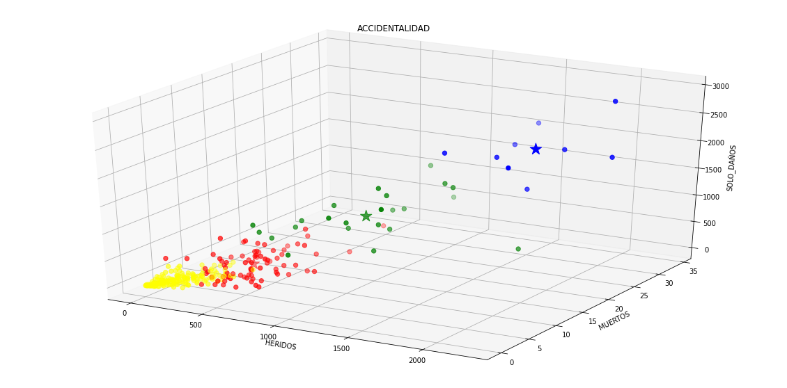
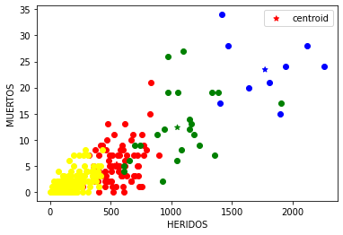
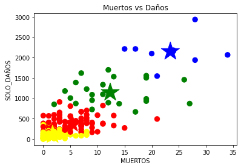

```{r, include=FALSE}
def.chunk.hook  <- knitr::knit_hooks$get("chunk")
knitr::knit_hooks$set(chunk = function(x, options) {
  x <- def.chunk.hook(x, options)
  ifelse(options$size != "normalsize", paste0("\n \\", options$size,"\n\n", x, "\n\n \\normalsize"), x)
})
```

```{r setup, include=FALSE}
knitr::opts_chunk$set(echo = TRUE, fig.align = 'center', size="footnotesize",
                      message = F, warning = F)
```

# Introducción


# Objetivos


# Descripción de los datos

Los datos utilizados se encuentran en las bases de datos de Geomedellín (Portal Geográfico del Municipio de Medellín) y contienen información referente a múltiples accidentes de tránsito, en los que se detalla el tipo de accidente, dónde y cuándo ocurrió. La base de datos utilizada en este trabajo es una unión de las bases de incidentes en 2014, 2015, 2016, 2017 y 2018, se usará este último año para validar los modelos planteados.

La base de datos original cuenta con las siguientes variables:

- X: Componente de coordenada.
- Y: Componente de coordenada.
- OBJECTID: Id de cada incidente.
- RADICADO: Código emitido por la secretaría de movilidad de Medellín.
- FECHA: Fecha del incidente.
- HORA: Hora del incidente.
- DIA: Día del mes en el que ocurre el incidente
- PERIODO: Año del incidente.
- CLASE: Tipo de accidente
- DIRECCION.
- DIRECCION_ENC.
- CBML: Código de ubicación del predio en la ciudad.
- TIPO_GEOCOD: Tipo de 
- GRAVEDAD: repercusiones del accidente
- BARRIO.
- COMUNA.
- DISENO: clasificación del lugar del accidente.
- DIA_NOMBRE: Día de la semana en el que ocurre el incidente
- MES: Mes del incidente en número (del 1 al 12)
- MES_NOMBRE: Mes del incidente
- X_MAGNAMED: Componente de coordenada
- Y_MAGNAMED: Componente de coordenada
- LONGITUD: Componente de coordenada
- LATITUD: Componente de coordenada


Se deciden eliminar las variables "X", "Y", "X_MAGNAMED" y "Y_MAGNAMED" ya que cumplen la misma función que las variables "LONGITUD" y "LATITUD". También se elimina la variable "RADICADO" ya que sirve para identificar a un respectivo incidente, al igual que la variable "OBJECTID". Se elimina la variable "MES_NOMBRE" ya que es redundante el la base de datos, debido a que se encuentra la misma información en la variable "MES". Además ponerle los nombres a partir de la variable "MES" traería un aumento al coste computacional innecesario. También se decide eliminar las variables "DIRECCION", "DIRECCION_ENC", "CBML", "TIPO_GEOCOD" y "HORA" ya no serán de utilidad en el modelo.

Además se crea otra variable llamada "DIA_FESTIVO". Para poder analizar el número de accidentes en los días festivos y demás fechas especiales. Por lo tanto, las variables de interés que se usan en este proyecto son las siguientes:

- OBJECTID: Id de cada incidente.
- CLASE: Tipo de accidente
- GRAVEDAD: repercusiones del accidente
- COMUNA.
- BARRIO.
- DISENO: clasificación del lugar del accidente.
- LATITUD: Componente de coordenada
- LONGITUD: Componente de coordenada
- FECHA: Fecha del incidente.
- DIA: Día del mes en el que ocurre el incidente
- MES: Mes del incidente en número (del 1 al 12)
- PERIODO: Año del incidente.
- DIA_NOMBRE: Día de la semana en el que ocurre el incidente
- DIA_FESTIVO.

Definido lo anterior, se realiza una limpieza en la base de datos, ya que hay registros u observaciones que están mal escritos o simplemente no deberían estar. A continuación se explican los cambios realizados.

## Depuración

Se decide quitar los acentos a cada una de las variables categóricas debido a que hay valores repetidos los cuales representan el mismo nivel o categoria, pero con acento y sin acento. Un ejemplo de esto es el barrio Berlin de la comuna Aranjuez, el cual aparece 647 veces con el nombre de "Berlin" y 15 veces con el nombre de "Berlín". Por lo tanto se decide arreglar este problema.

### Para COMUNA

La variable COMUNA debe tener las comunas urbanas de Medellín y sus corregimientos.

Se sabe que en Medellín hay 16 comunas urbanas y 5 corregimientos, ambos están compuestos por barrios, por lo que la variable debería tener 16 + 5 = 21 niveles. Pero al observar los niveles de la variable "COMUNA" en el conjunto de entrenamiento, se evidencian 84 comunas, por lo cual se decide buscar las razones de esto y tratar de corregirlo.

**Comunas:** Popular, Santa Cruz, Manrique, Aranjuez, Castilla, Doce de Octubre, Robledo, Villa Hermosa, Buenos Aires, La Candelaria, Laureles-Estadio, La América, San Javier, El Poblado, Guayabal, Belén.

**Corregimientos:** Corregimiento de San Cristóbal, Corregimiento de San Antonio de Prado, Corregimiento de Santa Elena, Corregimiento de Altavista, Corregimiento de San Sebastián de Palmitas.

Uno de los problemas que se encuentra es que la persona encargada de digitar los datos se confundió entre las variables "COMUNA" y "BARRIO". Un ejemplo de esto es el barrio Boston que aparece como comuna en 2 observaciones, con su respectiva comuna (La candelaria) en barrio. Así como el ejemplo anterior, hay varios casos. Por lo cual, estas comunas y barrios se ponen en su posición correcta.

Luego de resolver el problema anterior, se encuentra que aún hay comuna que no pertenecen a las 21 mencionadas anteriormente, estas son: "In", "AU", "SN", "0". Al no encontrar información de estos valores en la página oficial o en internet, se decide reemplazar estos valores con sus respectivos barrios como datos faltantes o NA.

### Para BARRIO

Se detecta que los barrios contienen algunos problemas de espacios, algunos ejemplos son:

- "Asomadera No. 1" y "Asomadera No.1"
- "Aures No. 2" y "Aures No.2"
- "Bombona No. 1" y "Bombona No.1"
- "B. Cerro  El Volador" y "B. Cerro El Volador"

Por lo tanto se arregla este problema quitando el espacio que hay entre "No." y su número correspondiente en los barrios que tienen esta característica. También se eliminan los espacios que hay antes de la primera letra y después de la última letra.

También se reemplaza "Barrios de Jesús" por "Barrio de Jesús", "Nueva Villa de La Iguana" por "Nueva Villa de la Iguana",  "Santa María de Los Ángeles" por "Santa María de los Ángeles", "Villa Lilliam" por "Villa Liliam".

### Para CLASE

"Caida de Ocupante" se reemplaza por "Caida Ocupante" ya que se consideran equivalentes. También se elimina la observación con CLASE = "Choque y Atropello" ya que solo hay una.

### Para DIA_NOMBRE

Se eliminan los espacios que hay antes de la primera letra y después de la última letra en todas las observaciones.

## IMPUTACIÓN

En los datos faltantes de la variable DISENO, se decide usar el nombre de "No Registrado" para reemplazarlos.

En la base de datos se tiene la siguiente cantidad de datos faltantes por variable: la variable BARRIO tiene 19957 de datos faltantes, COMUNA tiene 19957 y CLASE tiene 7. Las demás variables no contienen datos faltantes.

Como la variable CLASE solo tiene 7 datos faltantes, se decide eliminar estas observaciones. Por el contrario, como BARRIO y COMUNA presentan una cantidad importante de los datos, se decide realizar una imputación de los mismos.

### Para COMUNA


Primero se decide realizar la imputación en la variable COMUNA, se utiliza un modelo knn (k-Nearest Neighbour) con variable respuesta COMUNA y como predictoras las variables LATITUD y LONGITUD escaladas. Dado que este es un modelo que usa la distancia euclidiana para clasificar observaciones, se piensa que funcionaría bien para clasificar a las comunas teniendo su ubicación en latitud y longitud.

Para ajustar el modelo se usó la función `train` del paquete `caret`, usando K-Fold CV con *K=10* y el número de vecinos igual a 1, 4, 7, 10, 13, 16 y 19. Se entrenó el modelo usando los años de 2014 a 2017 y se validó con el año 2018. Se usó la precisión de prueba del modelo como función de optimización. Los resultados obtenidos son los siguientes:

\begin{table}[h]
\begin{center}
\begin{tabular}{|c|c|c|c|c|c|}
\hline
Accuracy & Kappa  & AccuracyLower & AccuracyUpper & AccuracyNull & AccuracyPValue \\
\hline
0.9985 & 0.9984 & 0.9981 & 0.9989 & 0.2062 & 0 \\
\hline         
\end{tabular}
\end{center}
\end{table}


 **Accuracy** | **Kappa** | **AccuracyLower** | **AccuracyUpper** | **AccuracyNull** | **AccuracyPValue** |
-------------| -------------|-------------| -------------|-------------| -------------|
0.9985 | 0.9984 | 0.9981 | 0.9989 | 0.2062 | 0  

{#id .class width=50% height=50%}


Los resultados se consideran buenos y se decide realizar el reemplazo de los valores faltantes de COMUNA por medio de este modelo.

\newpage

### Para BARRIO

Se decide usar un modelo knn (k-Nearest Neighbour) con variable respuesta BARRIO y como predictoras las variables LATITUD y LONGITUD escaladas y COMUNA.

Dado que habían valores de barrios que están en el año 2018 pero no en los demás, no se pudo hacer uso del paquete `caret` ya que presentaba un error al entrenar el modelo, por lo que se decide usar  la función `knn.cv` del paquete `class`, para medir el comportamiento del modelo knn con k = 1 mediante LOOCV, entrenando el modelo con los años de 2014 hasta 2017 y validando el resultado con el año 2018. Se obtiene una precisión de prueba de 0.9975, por lo que se decide usar este modelo para imputar los datos faltantes en BARRIO.

## Base final

Finalmente se decide usar solo las comunas del área urbana de Medellín y dejar a un lado los corregimientos, es decir, solo se tendrán las 16 comunas mencionadas anteriormente en este reporte.

Tras las modificaciones mencionadas, de las 228693 observaciones originales entre las bases de datos del 2014 al 2018, se utilizarán 204002 observaciones en el análisis y construcción de los modelos. La base de datos luce de esta manera:

```{r, echo=FALSE, rows.print = 5}
df <- read.csv(file = "Base_definitiva.csv", header = T, nrows = 50,
               stringsAsFactors = T)
df$FECHA <- as.Date(df$FECHA)
df; remove(df)
```

A continuación se encuentra el acceso al código utilizado en todo este proceso

Link: https://github.com/vagarciave/Project_x/blob/master/limpieza/Depuracion.Rmd

## Análisis descriptivo


# Clustering

En cuanto al clustering desarrollado para la clasificación de los barrios, se tomó el método de K-Means. Aquí, se tomó la decisión de basarnos en la columna de la gravedad ya que, no solo mostraría los barrios con más accidentalidad, sino el peligro que estos representan en cuanto a la seguridad vial.

Primero, fue necesario extraer las columnas BARRIO y GRAVEDAD de la base de datos, para así solo centrarnos en lo importante durante el proceso. 

```{r, echo=FALSE, rows.print = 5}
df <- read.csv(file = "Analisis1.csv", header = T, nrows = 50,
               stringsAsFactors = T)
df; remove(df)
```

Posteriormente, fue necesario hacer 2 pasos: primero se crearon 3 columnas correspondientes a los tipos de gravedad, asignando un valor de uno en la fila correspondiente al mismo tipo y un valor de cero para las demás; despues, fue necesario agrupar las columnas por barrio, para obtener la suma total de accidentes por barrio.

```{r, echo=FALSE, rows.print = 5}
df <- read.csv(file = "Analisis2.csv", header = T, nrows = 50,
               stringsAsFactors = T)
df; remove(df)
```
```{r, echo=FALSE, rows.print = 5}
df <- read.csv(file = "Analisis3.csv", header = T, nrows = 50,
               stringsAsFactors = T)
df; remove(df)
```

Más adelante y ahora con sólo los datos necesarios, se realizó el método del codo para encontrar el número de clusters, al mismo tiempos que se escogía la mejor división utilizando el método k-means++ que posee python. Todo esto arrojó que lo mejor sería dividir los datos en 4 clusters.

{#id .class width=50% height=50%}

Al realizar la respectiva clasificación se arrojó la siguiente gráfica, donde se puede observar la distribución de los barrios y se acepta la siguiente premisa: los 3 tipos de gravedad se relacionan entre sí, evidenciandose que a mayor numero de heridos, tambien hay mayor número de solo daños y muertos.

{#id .class width=50% height=50%}
{#id .class width=50% height=50%}
{#id .class width=50% height=50%}
{#id .class width=50% height=50%}

Para finalizar esta sección, se agregó la tabla que clasifica el riesgo del barrio en la base de datos pricipal, para proximamente mostrar esta distribución en el mapa de Medellín asignando colores a los clusters. La columna quedó con el nombre SEGURIDAD_BARRIO.


